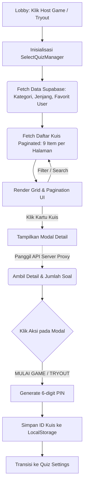

# Panduan Pembuatan Halaman Select Quiz

Halaman Select Quiz dibangun secara modular tanpa framework eksternal berat (menggunakan Vanilla TypeScript dan Tailwind CSS) yang dipisah menjadi 3 layer utama: **Data**, **UI**, dan **Controller**.


---

## 1. Data Layer: Integrasi Database (`QuizData.ts`)

File ini menghubungkan klien dengan database Supabase, menangani paginasi, dan menjaga keamanan soal dengan tidak mengirimkan data kunci jawaban ke klien pada query awal.

### A. Query Pagination dengan Multi-Filter
Query di bawah ini mengambil daftar kuis secara *server-side paginated* (`.range`) tanpa menyertakan field `questions` demi keamanan.

```typescript title="client/src/data/QuizData.ts"
export async function fetchQuizzesPaginated(options: PaginatedQuizOptions): Promise<PaginatedQuizResult> {
    const { page, limit, search, category, grade, language, favoriteIds, creatorId } = options;
    const from = (page - 1) * limit;
    const to = from + limit - 1;

    let query = supabase
        .from('quizzes')
        .select('id, title, description, category, grade, language, image_url, cover_image, is_public, creator_id, created_at, status, played, creator:profiles(nickname, avatar_url)', { count: 'exact' });

    if (creatorId) query = query.eq('creator_id', creatorId);
    else query = query.eq('is_public', true).eq('is_hidden', false).eq('status', 'active');

    if (search) query = query.ilike('title', `%${search.trim()}%`);
    if (category) query = query.ilike('category', category.trim());
    if (grade && grade !== 'all') query = query.eq('grade', grade.trim());
    if (language) query = query.eq('language', language.trim());
    if (favoriteIds) query = favoriteIds.length ? query.in('id', favoriteIds) : query.eq('id', '00000000-0000-0000-0000-000000000000');

    query = query.order('created_at', { ascending: false }).range(from, to);
    
    const { data, count } = await query;
    const totalPages = Math.ceil((count || 0) / limit);
    return { quizzes: formatQuizzes(data), totalCount: count || 0, totalPages, currentPage: page };
}
```

### B. Mengambil Detail Kuis via Proxy
Saat kartu kuis diklik, detail lengkap diambil melalui *proxy server* untuk melindungi data jawaban.
```typescript title="client/src/data/QuizData.ts"
export async function fetchQuizById(id: string): Promise<Quiz | null> {
    const res = await fetch(`/api/quiz/${encodeURIComponent(id)}`);
    if (!res.ok) return null;
    const row = await res.json();
    return formatQuizDetail(row); // Mengembalikan detail, jumlah soal, dan statistik kuis
}
```

---

## 2. UI Template: Struktur HTML & DOM (`ui.ts`)

File ini me-render struktur DOM utama seperti Search bar, Grid kuis, Pagination, dan Modal pop-up ke dalam `#quiz-selection-ui`.

```typescript title="client/src/scenes/host/selectquiz/ui.ts (Cuplikan)"
export class QuizSelectionUI {
    static render() {
        // ... (Render Navbar, Search Bar, & Filter Dropdowns) ...
        
        // Container Grid Kuis (3x3 per halaman)
        <div id="quiz-grid" class="w-full grid grid-cols-1 md:grid-cols-2 lg:grid-cols-3 gap-2.5"></div>
        
        // Pagination
        <div class="flex justify-center items-center gap-4">
            <button id="prev-page-btn">PREV</button>
            <div id="pagination-numbers"></div>
            <button id="next-page-btn">NEXT</button>
        </div>
        
        // ... (Render Modal Detail Pop-up) ...
        <div id="quiz-detail-modal" class="hidden fixed inset-0 z-[100] flex items-center justify-center">
             <!-- Modal dengan Badges Kategori, Statistik, tombol TRYOUT, & MULAI GAME -->
        </div>
    }
}
```

---

## 3. Controller & State Management (`page.ts`)

`SelectQuizManager` mengatur *lifecycle* halaman, mendengarkan input filter, me-render kartu, dan menangani navigasi transisi (contoh saat kuis dipilih).

```typescript title="client/src/scenes/host/selectquiz/page.ts (Alur Mulai)"
private selectQuizAndProceed(quiz: Quiz, isTryout: boolean) {
    this.closeQuizDetailModal();

    TransitionManager.transitionTo(() => {
        this.cleanup();
        this.hideUI();

        // 1. Generate PIN room 6 digit unik
        const roomCode = Math.floor(100000 + Math.random() * 900000).toString();

        // 2. Simpan data kuis sementara ke LocalStorage
        const prefix = isTryout ? 'tryout_' : '';
        localStorage.setItem(`${prefix}tempSettingsQuizId`, quiz.id);
        localStorage.setItem(`${prefix}pendingRoomCode`, roomCode);

        // 3. Pindah URL dan Load QuizSettingManager
        const nextUrl = isTryout ? `/tryout/${roomCode}/settings` : `/host/${roomCode}/settings`;
        Router.navigate(nextUrl);

        import('../[roomCode]/quizsetting/page').then(m => {
            const manager = new m.QuizSettingManager();
            manager.init({ quiz, client: this.client, roomCode, tryoutMode: isTryout });
        });
    });
}
```

---

## 4. Alur Data (Flow Diagram)

Alur logika pengguna dari mulai membuka halaman hingga berhasil memilih kuis:


