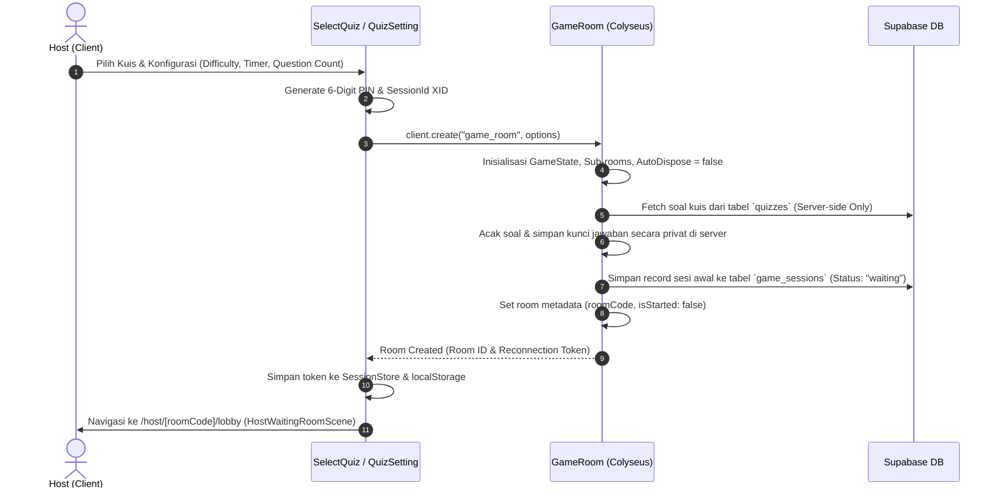

Berikut adalah alur lengkap mengenai sistem **Create Room** di Zigma berdasarkan kode sumber (*source code*) pada `client` dan `server`:

---

### Alur Kerja Create Room



Zigma memiliki **2 cara** pembuatan room:
1. **Manual Mode (Host via Aplikasi):** Host memilih kuis melalui `SelectQuizManager`, lalu mengatur konfigurasi permainan di `QuizSettingManager`.
2. **Auto-Create Mode (Kompetisi dari Admin Dashboard):** Room dibuat otomatis saat URL mendeteksi parameter query: `?quizId=...&gamePin=...&sessionId=...&hostId=...`.

---

### 1. Konfigurasi & Pembuatan Room di Sisi Client
**File:** [`client/src/scenes/host/[roomCode]/quizsetting/page.ts`](file:///c:/Users/ZUHRO/MultiplayerGameQuiz/client/src/scenes/host/[roomCode]/quizsetting/page.ts#L624-L695)

Ketika host menekan tombol konfirmasi pembuatan room:
1. Menyiapkan objek payload `options` (PIN, durasi timer, batas soal, tingkat kesulitan, map, dll.).
2. Menghapus sesi host sebelumnya untuk mencegah data *ghost session*.
3. Memanggil fungsi Colyseus `client.create("game_room", options)`.
4. Menyimpan data sesi baru (`currentSessionId`, `currentReconnectionToken`, `currentRoomCode`) ke `SessionStore` & `localStorage`.
5. Melakukan transisi visual dan navigasi ke rute `/host/${roomCode}/lobby`.

```typescript title="client/src/scenes/host/[roomCode]/quizsetting/page.ts"
const options = {
    roomCode: roomCode,          // 6-digit PIN acak
    sessionId: sessionId,        // 20-char XID database session
    difficulty: this.settingsDifficulty, // 'easy' | 'medium' | 'hard'
    subject: (this.selectedQuiz.category || "umum").toLowerCase(),
    quizId: this.selectedQuiz.id,
    quizTitle: this.selectedQuiz.title,
    map: mapFile,
    questionCount: this.settingsQuestionCount,
    enemyCount: enemyCount,
    timer: this.settingsTimer,   // dalam detik (misal 300s = 5 menit)
    hostId: hostId,
    authUserId: profile.auth_user_id || undefined,
    name: profile.nickname || profile.fullname || 'Host',
    avatarUrl: profile.avatar_url || "",
    isHost: true,
    isTryout: this.tryoutMode,
    hairId: this.tryoutHairId,
    quizDetail: {
        title: this.selectedQuiz.title,
        category: this.selectedQuiz.category,
        language: (this.selectedQuiz as any).language || 'id',
        description: this.selectedQuiz.description,
    },
    isMusicEnabled: this.soundEnabled
};

// 1. Bersihkan sesi host yang lama agar tidak bentrok
SessionStore.clearGameSession('host');
localStorage.removeItem('lastGameOptions');

// 2. Buat room baru di server Colyseus
const room = await this.client.create("game_room", options);

// 3. Simpan token koneksi untuk auto-restore jika browser ter-refresh
localStorage.setItem('currentRoomId', room.id);
SessionStore.set('currentSessionId', room.sessionId, 'host');
SessionStore.set('currentReconnectionToken', room.reconnectionToken, 'host');
SessionStore.set('isHost', 'true', 'host');
localStorage.setItem('currentRoomCode', roomCode);

// 4. Buka scene ruang tunggu host
TransitionManager.close(() => {
    window.history.pushState({}, '', `/host/${roomCode}/lobby`);
    this.startGameEngine('HostWaitingRoomScene', { room, isHost: true });
    setTimeout(() => TransitionManager.open(), 600);
});
```

---

### 2. Auto-Create Mode untuk Sesi Kompetisi
**File:** [`client/src/scenes/lobby/page.ts`](file:///c:/Users/ZUHRO/MultiplayerGameQuiz/client/src/scenes/lobby/page.ts#L1303-L1403)

Jika URL dibuka dengan parameter kompetisi (misalnya tautan dari dashboard admin/guru), fungsi `handleHostAutoCreate()` langsung mengunduh kuis terkait dan membuat room tanpa melalui pemilihan manual:

```typescript title="client/src/scenes/lobby/page.ts"
private async handleHostAutoCreate() {
    const urlParams = new URLSearchParams(window.location.search);
    const quizId = urlParams.get('quizId');
    const gamePin = urlParams.get('gamePin');
    const sessionId = urlParams.get('sessionId');
    const hostIdFromUrl = urlParams.get('hostId')?.trim() || null;
    const difficultyFromUrl = urlParams.get('difficulty')?.trim().toLowerCase() || 'easy';

    // Fetch detail kuis dari Supabase
    const { fetchQuizById } = await import('../../data/QuizData');
    const quiz = await fetchQuizById(quizId);

    const options = {
        roomCode: gamePin,
        sessionId: sessionId,
        dbSessionId: sessionId,
        difficulty: difficultyFromUrl,
        quizId: quizId,
        timer: 300,
        hostId: hostIdFromUrl,
        isHost: true,
        // ...
    };

    const room = await this.client.create("game_room", options);
    // Simpan ke SessionStore dan navigasi ke HostWaitingRoomScene
}
```

---

### 3. Inisialisasi Server Colyseus (`onCreate`)
**File:** [`server/src/rooms/GameRoom.ts`](file:///c:/Users/ZUHRO/MultiplayerGameQuiz/server/src/rooms/GameRoom.ts#L146-L215)

Di sisi server, fungsi `onCreate` bertanggung jawab atas inisialisasi lingkungan permainan:

1. **Anti Auto-Dispose:** Menetapkan `this.autoDispose = false` agar room tidak langsung terhapus jika host melakukan reload/refresh halaman browser.
2. **Patch Rate Jaringan:** Diatur ke `50ms` (20 update/detik) demi keseimbangan antara pergerakan mulus dan efisiensi memori.
3. **Keamanan Soal (*Server-Side Fetching*):** Soal kuis diambil langsung dari Supabase di server, **bukan dari client**. Kunci jawaban disimpan secara privat di server (`questionCorrectAnswers`) dan tidak disinkronkan ke client agar tidak bisa dibocorkan melalui Network tab browser.

```typescript title="server/src/rooms/GameRoom.ts"
async onCreate(options: any) {
    this.setState(new GameState());

    // Mencegah Colyseus OTOMATIS menghapus room saat host me-refresh halaman
    this.autoDispose = false;
    this.setPatchRate(50); // 20fps patch rate

    this.state.subject = options.subject || "matematika";
    this.state.difficulty = options.difficulty || "mudah";
    this.state.roomCode = options.roomCode || this.generateRoomCode();

    // SECURITY: Ambil soal langsung dari Supabase Utama di sisi server
    if (options.quizId) {
        const { data: quizRow } = await supabaseUtama
            .from("quizzes")
            .select("questions, title, category, language")
            .eq("id", options.quizId)
            .single();

        if (quizRow && Array.isArray(quizRow.questions)) {
            let rawQuestions = [...quizRow.questions];
            // Acak urutan soal
            rawQuestions.sort(() => Math.random() - 0.5);
            // Batasi jumlah soal sesuai pilihan host
            const questionCount = parseInt(String(options.questionCount)) || 0;
            if (questionCount > 0 && rawQuestions.length > questionCount) {
                rawQuestions = rawQuestions.slice(0, questionCount);
            }

            // Simpan ke array server-private
            this.serverQuestions = rawQuestions;
        }
    }
```

---

### 4. Setup Metadata, Sub-Rooms, & Simpan ke Database
**File:** [`server/src/rooms/GameRoom.ts`](file:///c:/Users/ZUHRO/MultiplayerGameQuiz/server/src/rooms/GameRoom.ts#L393-L426) & ([baris 3335–3365](file:///c:/Users/ZUHRO/MultiplayerGameQuiz/server/src/rooms/GameRoom.ts#L3335-L3365))

Server kemudian membagi kapasitas room, mengatur metadata publik untuk lobby, dan membuat baris record awal di database:

1. **Publish Metadata:** Client yang mencari room via `getAvailableRooms()` dapat membaca metadata publik (`roomCode`, `sessionId`, `isStarted: false`).
2. **Inisialisasi Sub-Rooms:** Kapasitas lobi maksimum adalah 51 pemain, yang dipecah ke dalam beberapa sub-room/pulau (misalnya per 4-8 pemain tergantung difficulty).
3. **Simpan Sesi Awal ke Database (`game_sessions`):** Membuat record berstatus `"waiting"` sebelum pemain mana pun masuk.

```typescript title="server/src/rooms/GameRoom.ts"
    // 1. Simpan metadata agar bisa dicari pemain di lobby
    this.setMetadata({
        roomCode: this.state.roomCode,
        sessionId: options.sessionId,
        hostId: this.originalHostId,
        isStarted: false,
    });

    // 2. Simpan record sesi ke tabel Supabase Utama (status: 'waiting')
    await this.retryAsync(
        async () => {
            await this.saveInitialSessionToMainSupabase();
        },
        { label: "saveInitialSession", maxAttempts: 5, delayMs: 2000 }
    );

    // 3. Konfigurasi Sub-Rooms sesuai tingkat kesulitan
    this.maxClients = 51; // 50 pemain + 1 host
    const config = ROOM_CONFIG[this.state.difficulty as keyof typeof ROOM_CONFIG];
    const subRoomCapacity = config ? config.maxPlayers : 4;
    const totalSubRooms = Math.ceil(this.maxClients / subRoomCapacity);

    for (let i = 1; i <= totalSubRooms; i++) {
        const sub = new SubRoom();
        sub.id = `Room ${i}`;
        sub.capacity = subRoomCapacity;
        this.state.subRooms.push(sub);
    }

    // 4. Pasang event handler pesan jaringan
    this.setupMessages();
}
```
